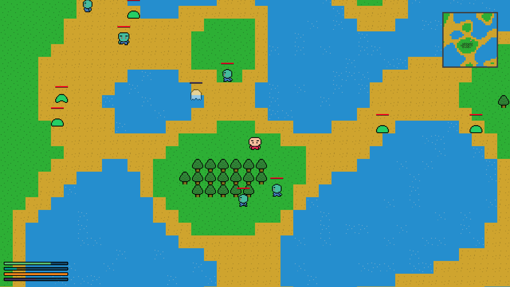

# 2D Game - Stew the Wanderer


## About this

This is an attempt at making a 2D game for the **ICS4UI**'s final project

- [2D Game - Stew the Wanderer](#2d-game---stew-the-wanderer)
  - [About this](#about-this)
  - [Screenshots](#screenshots)
  - [How To Play](#how-to-play)
  - [Keybindings](#keybindings)
  - [How To Run](#how-to-run)
  - [Folder Structure](#folder-structure)

## Screenshots



## How To Play

In this game, you're a wanderer, who was teleported to an unknown world.

You have to survive in this world by killing other creatures.

Your only goal is not to die. (*for now*)

You're equipped with high-level monitoring gears to check all your vitals.

From top to bottom:

- The first bar is your regeneration cooldown. When you're not at full health, the bar will start rising.
  - You will heal **1** unit of health when the bar is full.

- The second bar is your experience bar.
  - You will be able to increase your health capacity by **1** if this bar is full.

- The third bar is your hit cooldown.
  - You can only deal damage to something when the bar is full.

- The last bar is your health.
  - When you're in a normal state, this bar is red. However, it will turn into dark purple if you're cursed by a ghost.

You're also equipped with a small map that can quickly show your surrounding area.

## Keybindings

Gameplay-related Keybinds:

- **W**: Move up

- **S**: Move down

- **D**: Move right

- **A**: Move left

- **Space**: Attack

- **E**: Show the player's stats

- **M**: Toggle the map

- **X**: Zoom the map in

- **Z**: Zoom the map out

Application-related Keybinds:

- **ESC**: Pause the game

- **H**: Toggle the HUD

- **F**: Toggle between fullscreen mode and windowed mode

## How To Run

If you're using **Visual Studio Code**:

- If you clone this project into your local machine, good luck running it without **Code Runner**.

- Actually, even with **Code Runner**, you would probably need to edit the script inside `settings.json` in the `.vscode` folder.

- Your best bet is probably using your personal `settings.json` file.

- If you're using your own `setting.json` file, you **have to** include the `res` folder as a source folder along with the `src` folder by doing this:

```json
"java.project.sourcePaths": [
    "src",
    "res"
]
```

> With the `Extension Pack for Java`, you should be able to run the source code without the need of Code Runner.

If you're using **Replit**:

- I have it setup on **Replit**, so you can just press `Run`.

- However, I **do not** recommend running it on **Replit** because of how big this project is.

If you're running it via **Terminal** because you think you're cool:

```bash
git clone https://github.com/luut189/2DGame.git
cd 2DGame
cd src
javac -cp . -d ../bin dev/kyzel/App.java
java -classpath ../bin dev.kyzel.App
```

If you're using something else, **why?**

> Using **IntelliJ IDEA** is understandable though.

## Folder Structure

The workspace contains:

- `.vscode`: Visual Studio Code's settings

- `res`: Resources (*sprites*, *textures*, *musics*,...)

- `src/dev/kyzel`: Sources

  - `game`: Game-related components

    - `entity`: Entity-related components

    - `menu`: Menu-related components

    - `world`: World-related components

  - `gfx`: GUI-related components
  
  - `sfx`: Sound-related component

  - `utils`: Utilities components (mostly include ***Loaders*** for the game)

  - `App.java`: main class

Meanwhile, the compiled output files will be generated in the `bin` folder and ignored by `.gitignore` by default.

> If you are using Visual Studio Code, you can export `.jar` file if you have the `Extension Pack for Java` and it will be in the `build` folder.
